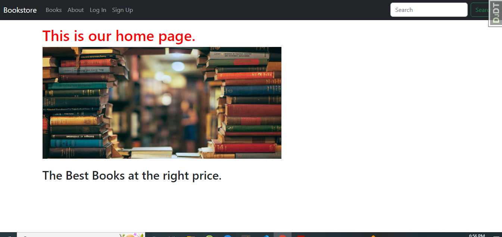

# Online Bookstore App

 

More screenshots

##### For the best experience, please use a device with a width of at least 350px

## About the app

This app is based on the book Django for Professionals by William vincent.
I have learned the following by developing the app based on the book.

* How to use Docker in Django
* How to implement test driven development in django 
* How to integrate Postgres Sql in Django  
* How to optimize app performance using django-debug-toolbar
* How to implement security features before deployment

## Built using:
- Python with Django framework and Jinja templating language
- Docker

## Getting started:
- Clone this repository or fork it
    - To clone this repository type git clone `https://github.com/Henoker/bookstore.git` on your command line
    - To fork this repository, click fork button of this repository then type git clone `https://github.com/<your username>/bookstore.git`
- Install all the dependencies of this project by typing `docker-compose up -d --build ` on the command line
- configure your Postgres Databse 
- Migrate the database by typing `docker-compose exec web python manage.py makemigrations accounts` on the command line
- Run the project locally by typing `docker-compose exec web python manage.py runserver` on the command line
    - NB: to run it on your local network, type `python manage.py runserver 0.0.0.0:8000`
- You project will be accessible in your localhost or local network.

## License
Distributed under the [MIT](https://github.com/Henoker/bookstore/blob/master/LICENSE) License. See [`LICENSE`](https://github.com/Henoker/bookstore/blob/master/LICENSE) for more information.

## Contact
- Henock Beyene Testfatsion - [hennybany@gmail.com](mailto:hennybany@gmail.com)
- Project link: https://github.com/Henoker/bookstore

## Love my effort?

<a href='https://www.linkedin.com/in/henock-beyene-tesfatsion-921ba54b/' target='_blank'>